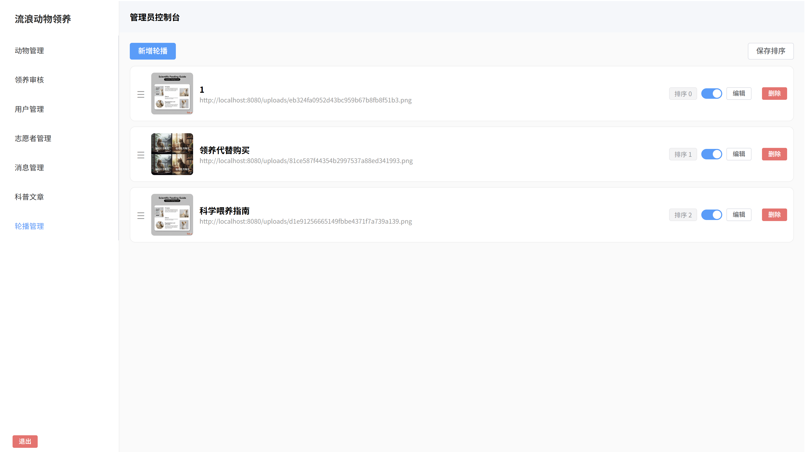
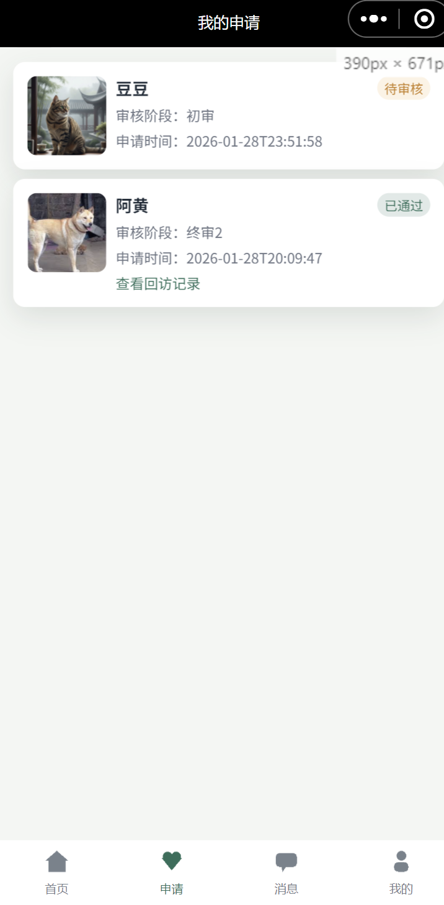
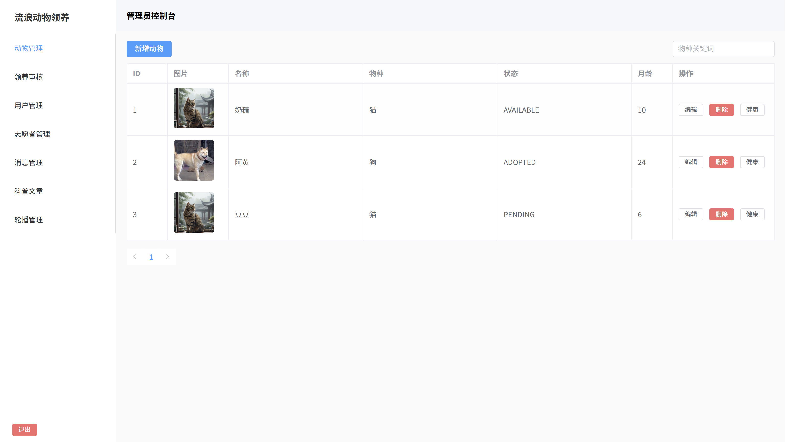
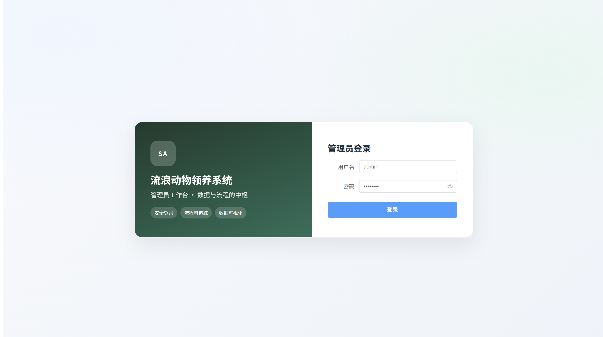
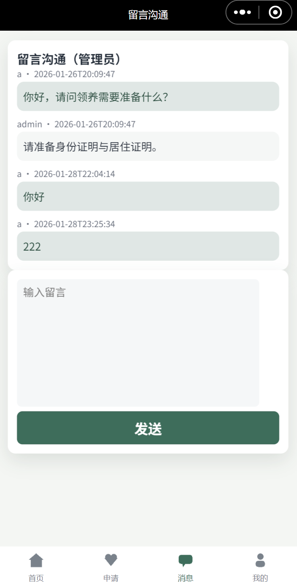
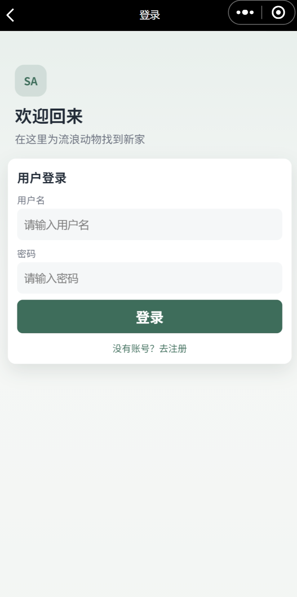

# 基于微信小程序的流浪动物领养系统：全栈实现与功能亮点

**关键词**：微信小程序、毕业设计、展示仓

> **展示仓库**：含课题工坊介绍、官方演示截图与少量示例代码。  
> **不是**完整可运行交付包 / 不是客户论文源码导出。

---

## 相关链接（优先看这里）

| 说明 | 链接 |
|------|------|
| **课题工坊 · 本项目详情（图文/演示）** | [https://app.bysj.site/?page=products&product=19](https://app.bysj.site/?page=products&product=19) |
| 计算机毕设定制官网 · 毕设无忧 | https://www.bysj.site |
| 课题工坊 · 全部项目列表 | https://app.bysj.site/?page=products |
| 开源展示清单（全部仓库） | https://github.com/babachen/bysj-open-source-catalog |
| 博客 · 选题落地指南 | https://www.bysj.site/blog/p/computer-science-graduation-project-guide |
| 博客 · 开题报告写法 | https://www.bysj.site/blog/p/how-to-write-proposal |
| 博客专栏 | https://www.bysj.site/blog/ |

**说明**：本仓库为教学展示 / 架构与界面样例，仅包含部分说明与示例代码，**不是完整交付源码**。  
完整可运行项目、论文与部署辅导请通过 [官网](https://www.bysj.site) 或 [课题工坊](https://app.bysj.site/?page=products&product=19) 了解。

---

## 项目简介

（见工坊详情）

工坊商品 ID：`19`  
仓库：`graduation-pet-adoption-19`

---

## 主要功能（来自课题工坊介绍结构）

- 一、项目目标
- 三、核心功能
- 用户端（小程序）
- 管理端（Vue）
- 四、系统亮点
- 五、数据库设计概览
- 演示与截图说明

---

## 项目演示截图（来自课题工坊）

以下图片同步自工坊商品页，便于在 GitHub 直接预览：

### 界面截图 1

### 界面截图 2

### 界面截图 3

### 界面截图 4

### 界面截图 5

### 界面截图 6

> 更多高清动图/完整说明请打开：https://app.bysj.site/?page=products&product=19

---

## 完整图文介绍（工坊原文同步）

完整 Markdown 已同步到本仓：

- [`docs/PRODUCT.md`](./docs/PRODUCT.md)

（正文中的图片已尽量改为本地 `docs/screenshots/` 路径。）

---

## 技术栈（教学向，以工坊/交付为准）

常见实现形态：**Spring Boot + Vue + MySQL** 或 **Android + 后端**（以本项目工坊说明为准）。

详见 `docs/PRODUCT.md` 中的技术说明章节。

---

## 本仓有什么 / 没有什么

| 包含 | 不包含 |
|------|--------|
| 工坊介绍全文（Markdown） | 完整前后端可运行工程 |
| 官方演示截图 | 客户论文 / 任务书 / 隐私数据 |
| 工坊与演示外链 | 未授权的整包商业源码 |
| 少量 `samples/` 示例 | 一键 `mvn spring-boot:run` 的全套系统 |

---

## 示例代码

见 [`samples/`](./samples/)（统一响应体、示例接口、表结构片段等，便于理解风格）。

---

## License

MIT（展示文案与示例代码）。完整商品权益以 https://www.bysj.site 与课题工坊规则为准。
